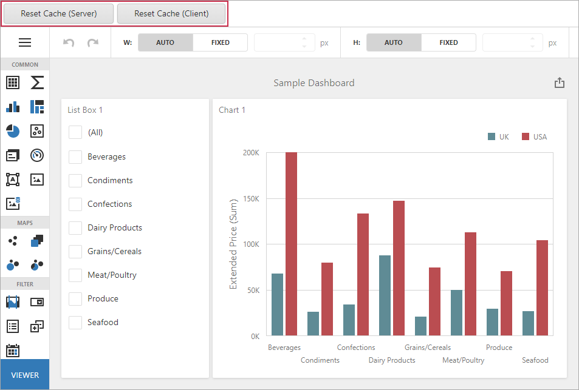

<!-- default badges list -->

<!-- default badges end -->

# Dashboard for Web Forms - How to Reset the Data Source Cache on the Server

The following example shows how you can manage the cache in the ASP.NET Web Forms Dashboard control.

To refresh the data source cache **on the server**, pass a unique parameter value to the [ASPxDashboard.CustomParameters](https://docs.devexpress.com/Dashboard/DevExpress.DashboardWeb.ASPxDashboard.CustomParameters) event. You can store the unique GUID value within a session as a parameter and update its value in your code when it is necessary to refresh the cache.

To refresh the data source cache **on the client**, you can call the [DashboardControl.reloadData](https://docs.devexpress.com/Dashboard/js-DevExpress.Dashboard.DashboardControl#js_DevExpress_Dashboard_DashboardControl_reloadData) client method.

- Click **Refresh Cache (Server)** to force the cache reset on the server.
- Click **Refresh Cache (Client)** to force the cache reset using the client API.

## Files to Look At

* [Default.aspx.cs](/CS/WebFormsDashboardUseDifferentCaches/Default.aspx.cs) (VB: [Default.aspx.vb](/VB/WebFormsDashboardUseDifferentCaches/Default.aspx.vb))
* [CacheManager.cs](/CS/WebFormsDashboardUseDifferentCaches/CacheManager.cs) (VB: [CacheManager.vb](/VB/WebFormsDashboardUseDifferentCaches/CacheManager.vb))

## Documentation

- [Manage an In-Memory Data Cache](https://docs.devexpress.com/Dashboard/400984)

## More Examples

- [Dashboard for MVC - How to Reset the Cache Forcedly in MVC Dashboard](https://github.com/DevExpress-Examples/mvc-dashboard-use-different-caches)
- [Dashboard for ASP.NET Core - How to Reset the Cache Forcedly in ASP.NET Core Dashboard](https://github.com/DevExpress-Examples/aspnet-core-dashboard-use-different-caches)
